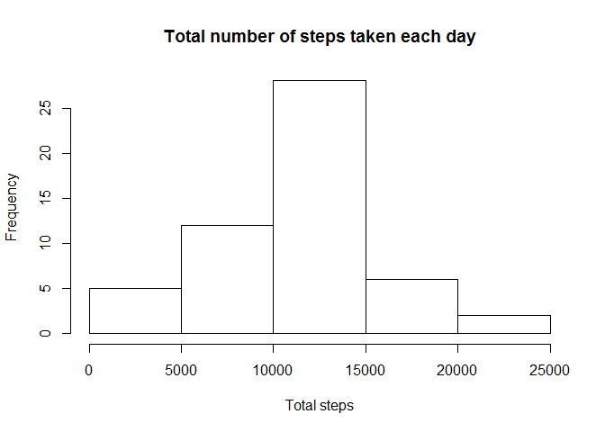
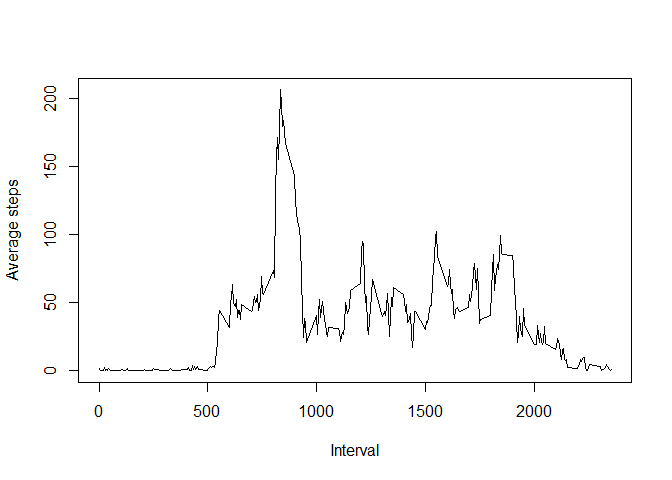
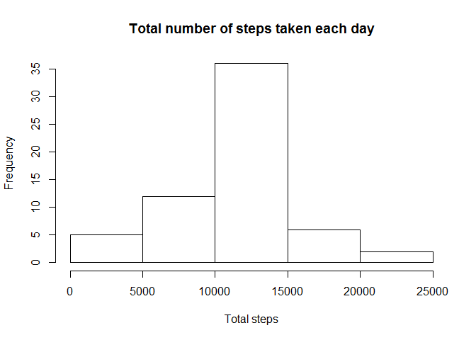

# Reproducible Research: Peer Assessment 1


## Loading and preprocessing the data

```r
myDF <- read.csv("activity.csv")
totalDF <- setNames(aggregate(myDF$steps ~ myDF$date, FUN = sum, na.rm = TRUE),c("date", "steps"))
```


## What is mean total number of steps taken per day?
Histogram of total number of steps taken each day.


```r
hist(totalDF$steps, main = "Total number of steps taken each day", xlab = "Total steps")
```

 


The mean of total number of steps taken each day.


```r
mean(totalDF$steps, na.rm = TRUE)
```

```
## [1] 10766.19
```
The median of total number of steps taken each day.


```r
median(totalDF$steps, na.rm = TRUE)
```

```
## [1] 10765
```


## What is the average daily activity pattern?
Time series plot (i.e. type = "l") of the 5-minute interval (x-axis) and the average number of steps taken, averaged across all days (y-axis)


```r
dailyAve <- setNames(aggregate(myDF$steps ~ myDF$interval, FUN = mean, na.rm = TRUE),c("interval", "steps"))
interval <- unique(myDF$interval)
plot(dailyAve$interval, dailyAve$steps, type = "l", xlab = "Interval", ylab = "Average steps")
```

 


Which 5-minute interval, on average across all the days in the dataset, contains the maximum number of steps?


```r
dailyAve[which(dailyAve$steps == max(dailyAve$steps)),]
```

```
##     interval    steps
## 104      835 206.1698
```


## Imputing missing values
Number of missing values

```r
bad <- is.na(myDF$steps)
sum(bad)
```

```
## [1] 2304
```

My strategy is to replace the 'NA's with the mean of that 5-minute interval


```r
aggregated <- aggregate(myDF$steps, by = list(myDF$interval), FUN = mean, na.rm = TRUE )
names(aggregated) <- c("interval", "stepsMean")

myDF <- merge(myDF, aggregated, by = "interval")
head(myDF)
```

```
##   interval steps       date stepsMean
## 1        0    NA 2012-10-01  1.716981
## 2        0     0 2012-11-23  1.716981
## 3        0     0 2012-10-28  1.716981
## 4        0     0 2012-11-06  1.716981
## 5        0     0 2012-11-24  1.716981
## 6        0     0 2012-11-15  1.716981
```

```r
myDF$imputedSteps <- rep(0, length(myDF$steps))
myDF$imputedSteps <- is.na(myDF$steps)*myDF$stepsMean
myDF$imputedSteps[!is.na(myDF$steps)] <- myDF$steps[!is.na(myDF$steps)]

imputedDF <- myDF[,c("interval", "imputedSteps", "date")]
names(imputedDF)[2] <- "steps"
totalDF.Imputed <- setNames(aggregate(imputedDF$steps ~ imputedDF$date, FUN = sum, na.rm = TRUE),c("date", "steps"))
```

Histogram of the total number of steps taken each day

```r
hist(totalDF.Imputed$steps, main = "Total number of steps taken each day", xlab = "Total steps")
```

 

Mean and median for the imputed dataset

```r
mean(totalDF.Imputed$steps, na.rm = TRUE)
```

```
## [1] 10766.19
```

```r
median(totalDF.Imputed$steps, na.rm = TRUE)
```

```
## [1] 10766.19
```


## Are there differences in activity patterns between weekdays and weekends?
Turns out there are differences, see the plot below.

```r
library(lattice)
imputedDF$weekend <- weekdays(strptime(imputedDF$date, format = "%Y-%m-%d")) %in% c("Saturday","Sunday")
imputedDF$daytype[imputedDF$weekend] <- "weekend" 
imputedDF$daytype[!imputedDF$weekend] <- "weekday" 
imputedDF$daytype <- as.factor(imputedDF$daytype)
dailyAve.daytype <- setNames(aggregate(imputedDF$steps ~ imputedDF$interval + imputedDF$daytype, FUN = mean, na.rm = TRUE),c("interval","daytype", "steps"))
xyplot(steps ~ interval | daytype, data = dailyAve.daytype, layout = c(1,2), panel = function(x, y, ...) {
    panel.xyplot(x,y,type="l")
})
```

 
